# CodingVibes – Java Swing Course Management System

<p align="center">


</p>

A desktop-based **Course Management System** developed using **Java Swing** as part of academic coursework. The application simulates the workflow of an online learning platform where users can browse programming courses, manage a shopping cart, simulate purchases, and where administrators can manage users through a dedicated dashboard.

The project demonstrates **Object-Oriented Programming (OOP)** principles, **event-driven programming**, modular GUI design, and role-based application flow.

---

# ✨ Features

## 👤 User Module

- Secure user login interface
- Browse programming courses
- Course detail pages
- Add courses to shopping cart
- Remove courses from cart
- Simulated checkout process
- Multiple payment options
- Contact page
- About section
- Customer reviews page
- Responsive menu-driven navigation

---

## 🛡️ Admin Module

- Separate administrator login
- Admin dashboard
- Add new users
- Remove existing users
- View registered users
- Add developers
- User information management

---

## ⚙️ Application Highlights

- Java Swing graphical interface
- Event-driven architecture
- Object-Oriented Programming
- Modular source code organization
- Desktop application workflow
- Static data simulation
- Academic project focused on GUI development

---

# 🖼️ Application Showcase

## Landing Page

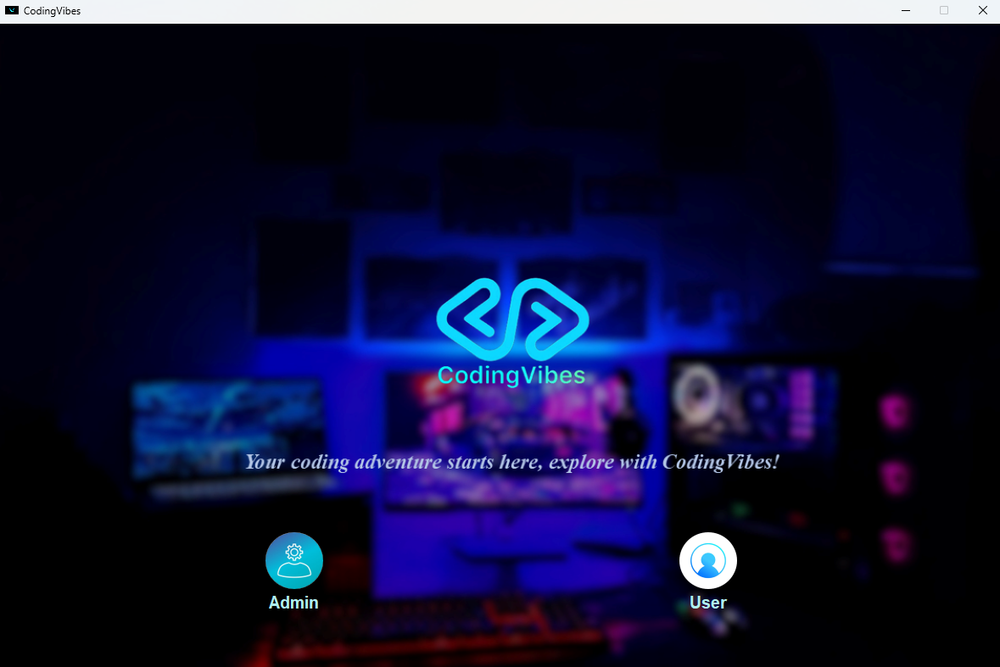

---

## User Login

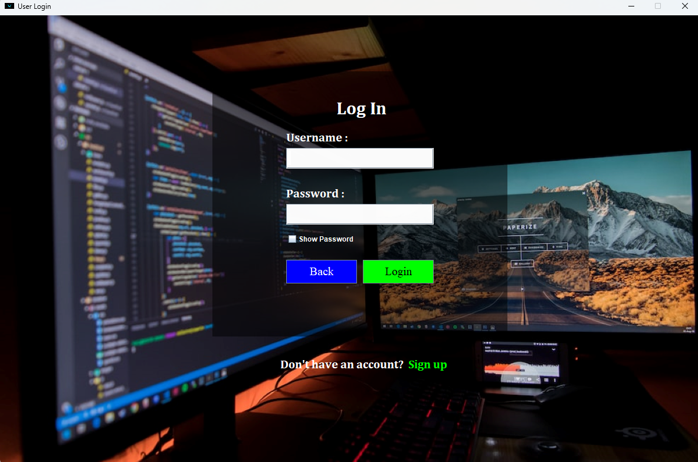

---

## Main Menu

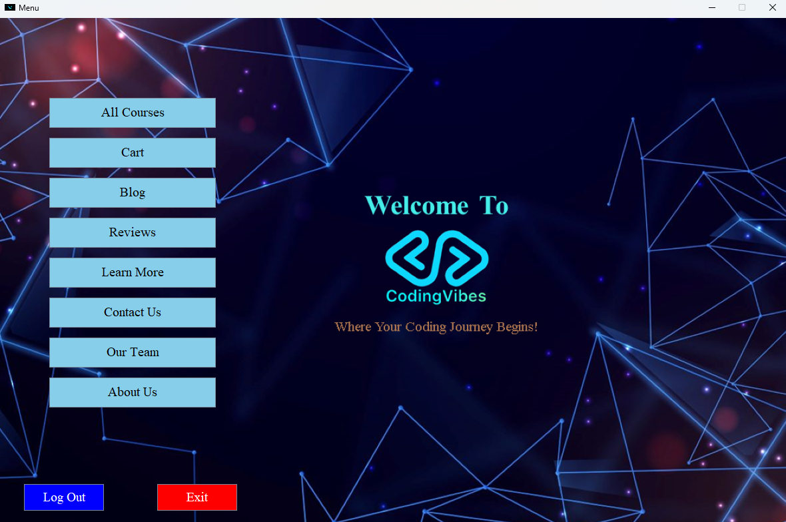

---

## Browse Courses

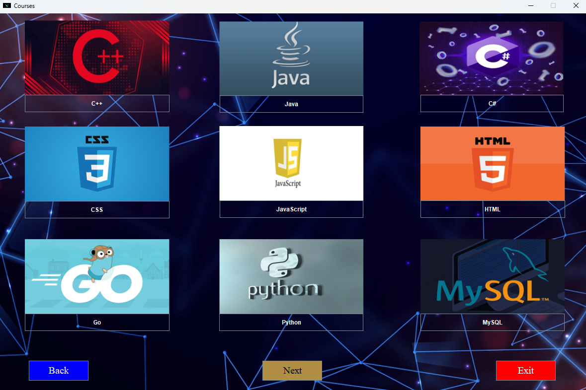

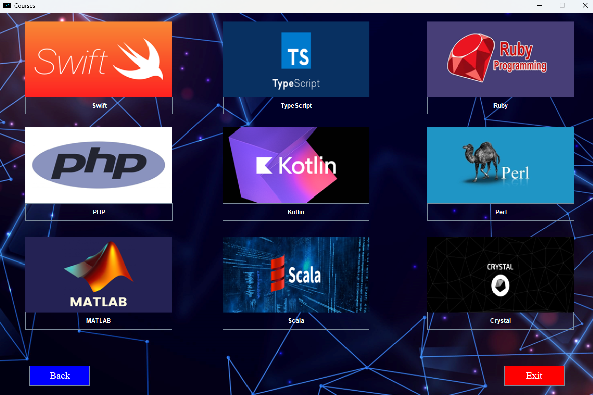

---

## Course Details

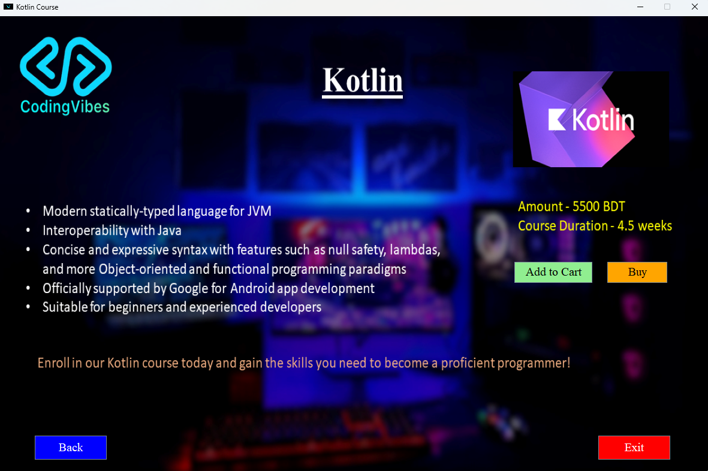

---

## Payment Options

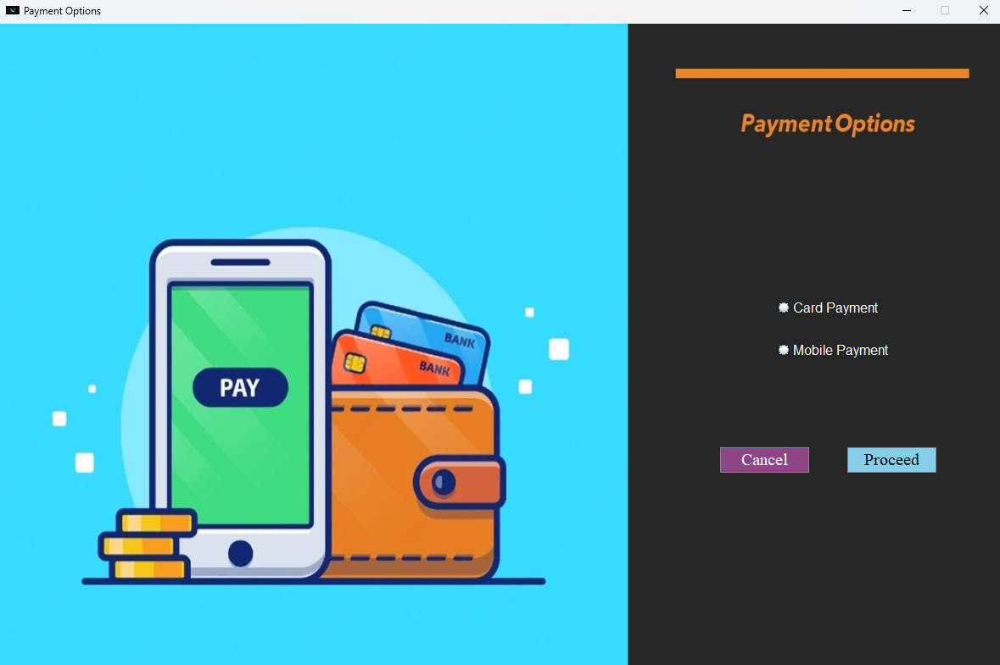

---

## Shopping Cart

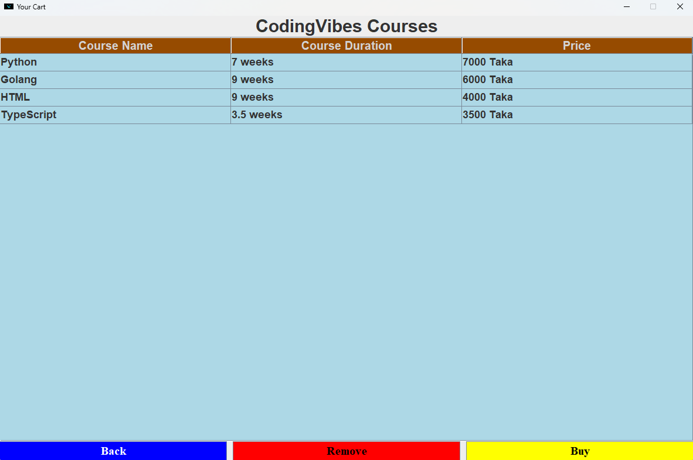

---

## Admin Login

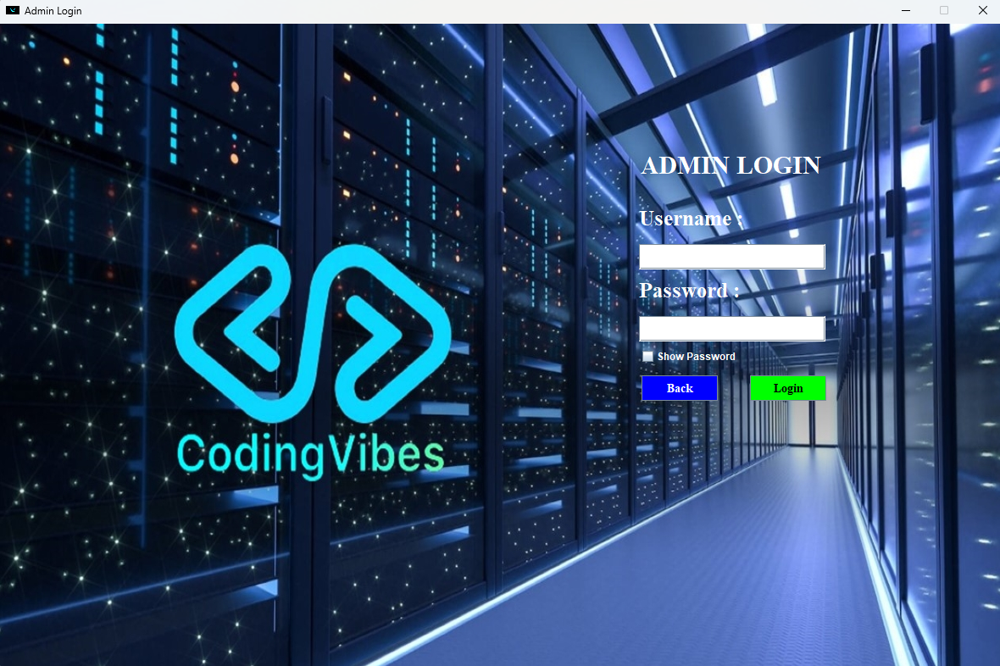

---

## Admin Dashboard

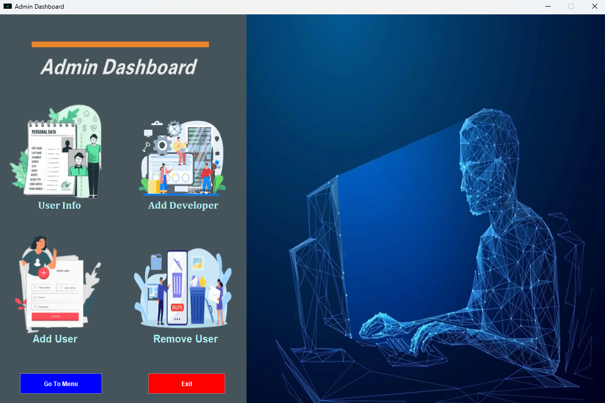

---

## Add User

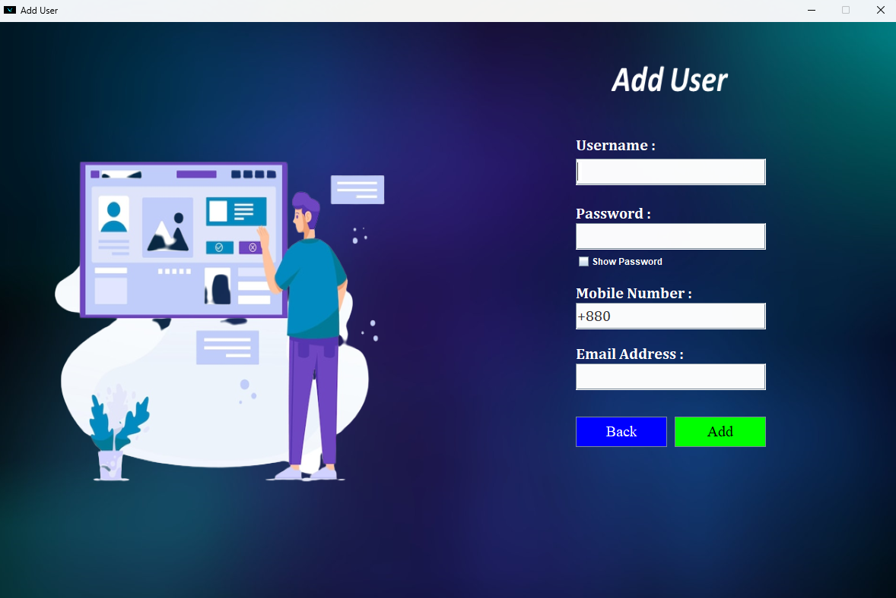

---

## User Management

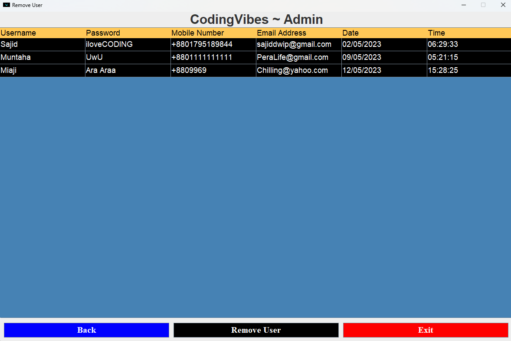

---

## Reviews

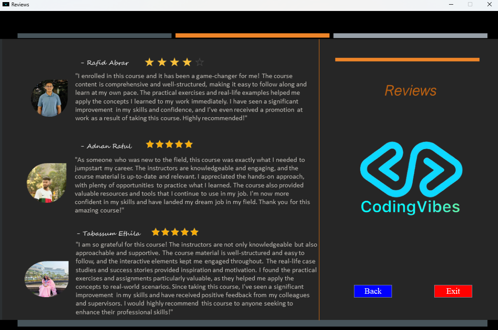

---

# 🏗 Project Structure

```
codingvibes-java-gui/
│
├── assets/
├── src/
│   ├── Data/
│   ├── Interfaces/
│   ├── Photos/
│   ├── SourceFiles/
│   └── Start.java
│
├── Screenshots/
├── LICENSE
└── README.md
```

---

# 🛠 Technologies Used

- Java
- Java Swing
- Java AWT
- Object-Oriented Programming (OOP)
- Event-Driven Programming

---

# ▶️ Getting Started

## Prerequisites

- Java JDK 17 or later
- IntelliJ IDEA / Eclipse / NetBeans (recommended)

---

## Run the Project

Clone the repository

```bash
git clone https://github.com/Saji-d/codingvibes-java-gui.git
```

Navigate into the project

```bash
cd codingvibes-java-gui
```

Open the project in your preferred Java IDE.

Run:

```
Start.java
```

The application will launch as a desktop GUI.

---

# 📚 Learning Outcomes

This project helped reinforce concepts including:

- Java Swing GUI Development
- Object-Oriented Programming
- Event Handling
- Desktop Application Design
- User Interface Navigation
- Modular Programming
- Academic Software Engineering Practices

---

# ⚠️ Disclaimer

This application is created solely for educational purposes.

The following features are **simulations only**:

- Payments
- Shopping Cart
- Customer Reviews
- Contact Information
- User Data

No real financial transactions, authentication services, or online communication are performed.

---

# 👨‍💻 Author

**Sajidur Rahman Sajid**

B.Sc. in Computer Science & Engineering

American International University-Bangladesh (AIUB)
